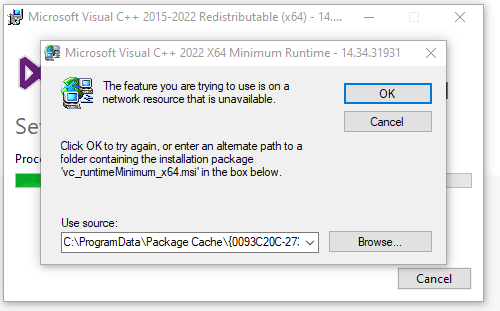

Not really a post about programming but an annoying thing from my own Windows machine.

I was getting an error about a missing Microsoft Visual C++ Runtime. It happened every time I launched a game and was also preventing me from installing different versions of the runtime. Said version appeared in the installed programs list but the installer wasn't there and it couldn't be uninstalled or repaired either.

Here's the error message:

> The feature you are trying to use is on a network resource that is unavaible.

The fix is to find and download the correct version from [Visualstudio.com](https://my.visualstudio.com/Downloads?q=visual%20studio%202019&wt.mc_id=o~msft~vscom~older-downloads). You'll need to create a free account to get access. The link is also on [this knowledge base page](https://learn.microsoft.com/en-us/cpp/windows/latest-supported-vc-redist?view=msvc-160)

Once on my.visualstudio.com the version column in the search results unfortunately doesn't match the version listed in the installer. In my case the installer was complaining about version 14.24.28127 being missing and this was visual C++ 2019 16.4 x86. Infurating that the version in the search results isn't the actual version.