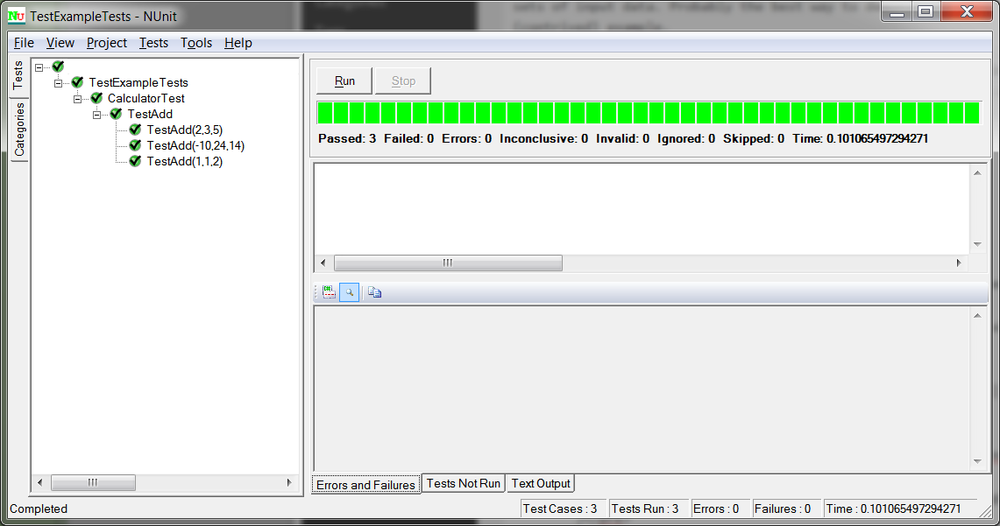

## What is NUnit and why use it?

NUnit is a .NET port of the popular JUnit test library for Java. It has several advantages that Microsoft's test framework doesn't.

If you run MS Tests or NUnit tests in visual studio then all your tests appear as a flat list in the test explorer. You only get the method names. If you use the NUnit runner you get the full namespace/class/method hierarchy as seen in the screenshot below.



An extension is required to run NUnit tests in Visual Studio. Go to Tools &rarr; Extensions and Updates, then search for "NUnit Test Adapter" and install it.

The final difference to MS Tests is that you can write your tests in the same assembly as your production code. Microsoft enforces separating tests into a different library. Naturally, you can always put your NUnit tests in a separate test dll if you prefer that separation.

## Parameterized Tests

One useful feature in NUnit is the ability to easily add parameters to a test case. This lets you write a single test and call it with a several sets of input data. Probably the best way to demonstrate this is with a (contrived) example.

Say you have a `Calculator` class that you're wanting to test. The usual way of testing the `Add` function would be to write a number of test cases which call `Add` with different values:

```
[Test]
public void TestAddOneAndOne()
{
    Assert.AreEqual(2, calculator.Add(1, 1));
}

// ... more [Test] methods follow for different arguments.
```

Parameterized tests with the `TestCase` attribute allow you to write all the different argument combinations concisely:

```
[TestCase(1, 1, 2)]
[TestCase(2, 3, 5)]
[TestCase(-10, 24, 14)]
public void TestAdd(int arg1, int arg2, int expectedResult)
{
    Assert.AreEqual(expectedResult, calculator.Add(arg1, arg2));
}
```

Each `TestCase` runs this method once, passing in the arguments specified. See the previous NUnit runner screenshot for how these test cases appear when run. See the [TestCase documentation](http://www.nunit.org/index.php?p=testCase&r=2.6.3) for more information.

## Parameterized tests in JUnit

When I started writing this post, I was originally planning to say that parameterized tests are something NUnit has that JUnit doesn't, but a quick search showed that [JUnit also has parameterized tests](https://github.com/junit-team/junit/wiki/Parameterized-tests). The real difference between the NUnit and JUnit implementation is that the syntax is quite messy in JUnit. I've never seen any parameterized tests in any JUnit code I've worked on. In contrast, the NUnit syntax is clean and much easier to remember and I have made use of it in a few projects now.